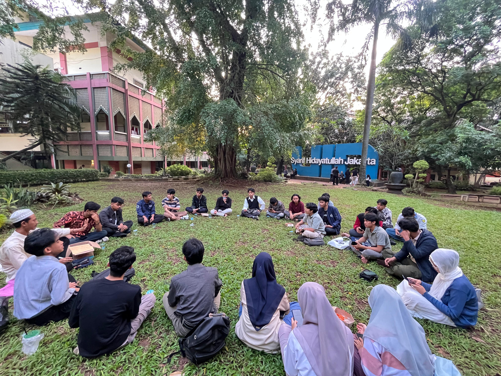

Landmark UIN Syarif Hidayatullah Jakarta, 3 Juli 2025   

Pergerakan Mahasiswa Islam Indonesia (PMII) Komisariat Fakultas Dirasat Islamiyah (KOMFAKDISH) menggelar diskusi interaktif perdana bertajuk DISTRAKSI (Diskusi Interaktif Sahabat Literasi), yang mengangkat tema menarik:  

"Pengertian bid’ah dan sunnah perspektif kitab Risalah Ahlusunnah Wal Jama’ah".  

Acara ini menghadirkan Sahabat Ivan Abid Nugraha, salah satu kader aktif PMII KOMFAKDISH, yang mengupas secara ringan namun ilmiah bagaimana pandangan Ahlusunnah Wal Jama’ah terhadap konsep bid’ah dan sunnah.  

📖 Kitab Risalah Ahlusunnah Wal Jama’ah, yang menjadi rujukan utama dalam diskusi ini, merupakan karya yang menegaskan prinsip moderat (tawassuth), toleran (tasamuh), dan seimbang (tawazun) dalam beragama. Di dalamnya dijelaskan bahwa:  

Bid’ah tidak serta merta berarti sesat. Ulama Ahlusunnah membaginya menjadi bid’ah hasanah (baik) dan bid’ah sayyi’ah (buruk).  

Sunnah diposisikan sebagai warisan penting dari Rasulullah SAW yang perlu dilestarikan sesuai konteks dan maqashid syariah.  

Diskusi ini bukan hanya memperluas wawasan keislaman mahasiswa, tapi juga menjadi ruang klarifikasi terhadap istilah yang kerap disalahpahami di masyarakat.  

🔎 Acara ini menjadi bukti bahwa literasi keislaman mahasiswa PMII semakin tajam dan solutif di tengah wacana-wacana keagamaan yang sering disalahpahami.  

🕓 Acara dimulai pukul 16.00 WIB dan berlangsung hingga selesai, dengan antusiasme peserta yang tinggi. Untuk kamu yang belum sempat hadir, pastikan jangan ketinggalan seri DISTRAKSI berikutnya!  

